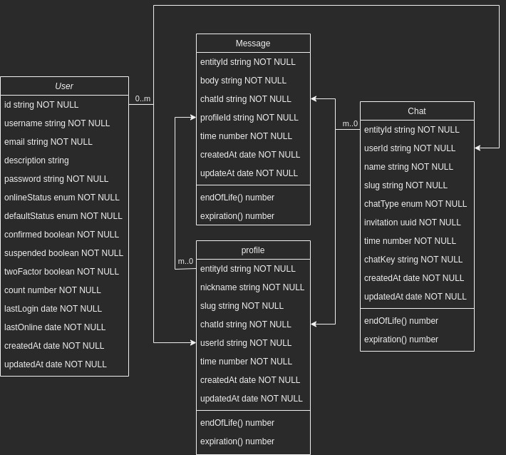

# Ephemeral Chats

## Description

Ephemeral Chats is a TypeScript NodeJS app made with [NestJS](https://nestjs.com/)
, [Apollo GraphQL](https://www.apollographql.com/docs/apollo-server/), [RedisOM](https://github.com/redis/redis-om-node)
and [MikroORM](https://mikro-orm.io/).

It's a real-time web app where you can build temporary chat rooms, from 5 minutes to 24 hours, to chat with your
friends, or anyone you invite into the room.

## Video Overview

@todo: Upload Video to YouTube

## How it works

#### Databases:

In terms of databases there are two main ones:

- [MongoDB](https://www.mongodb.com/)
- [Redis](https://redis.io/)

The MongoDB database is used to store the data that needs to be persisted, mainly the Users as we need them for Auth. I
chose MongoDB as I wanted to save everything as a JSON Object to go with the hackathon theme Redis, but I still wanted
some assurances that the data would be persisted and any database transaction wouldn't be lost, so I chose MongoDB, a
NoSQL database that since version 4 has
some [ACID transaction features](https://www.mongodb.com/basics/acid-transactions).

Since most of the data is ephemeral, we don't need to persist it, so we use Redis and RedisJSON for the rest: Chat
Rooms, Profiles and Messages.

#### Class Diagram:

[](class-diagram.drawio)

### How the data is stored:

- Users are stored in MongoDB as a JSON Object, with a unique ID and a hashed password. Everytime a User Instance is
  accessed its stored on Redis for 24h to boost read speeds.
- Chat Rooms are stored in Redis as a RediJSON Object with a TTL (Time To Live) of 5 minutes to 24 hours.
- Profiles are stored in Redis as a RediJSON Object with TTL equal to the Chat Room's TTL.
- Messages are stored in Redis as a RediJSON Object with a TTL equal to the Chat Room's TTL.

### How the data is accessed:

- Most of the data is access with Redis' Search, using indexes and queries to get the data we need.
- Single users are fetched from Redis as they'll be stored there for 24h. However, multiple users will still be fetched
  from MongoDB.
- When fetching multiple entities, I cursor paginate them, including when using Redis' Search.

## How to run it locally

### Prerequisites:

- Docker or Podman;
- Docker-compose or Podman-compose;
- NodeJS 16 with corepack enabled.

### Steps:

1. Clone the repo.
2. Install the dependencies:

```bash
$ yarn install
```

3. Create a .env file with all the fields equal to the [example](.env.example).
4. Start the containers:

```bash
$ podman-compose up
```

5. Start the app once:

```bash
$ yarn start:dev
```

6. Copy the generated MASTER_KEY that appears in the console and paste it in the .env file.
7. Start the app again:

```bash
$ yarn start:dev
```

## Deployment

### Steps:

1. Go to [DigitalOcean](https://www.digitalocean.com/), [Linode](https://www.linode.com/)
   or [Hetzner](https://www.hetzner.com/);
2. Create a server running [Ubuntu LTS](https://ubuntu.com/);
3. Install [dokku](https://dokku.com/docs~v0.28.1/getting-started/installation/#1-install-dokku);
4. Run the following commands on your server for dokku initial set-up:

```bash
$ cat ~/.ssh/authorized_keys | dokku ssh-keys:add admin
$ dokku domains:set-global your-global-domain.com
```

5. Create a new app and connect git:

```bash
$ dokku apps:create ephemeral-chats
```

6. Go to [redis cloud](https://redis.com/try-free/) and create a new instance with RediJSON and RediSearch;
7. Add the [Mongo plugin](https://github.com/dokku/dokku-mongo) to dokku, and create a new instance of MongoDB:

```bash
$ dokku mongo:create ephemeral-chasts-db
$ dokku mongo:link ephemeral-chats-db ephemeral-chats
```

8. Add all the configurations:

```bash
$ dokku config:set ephemeral-chats REDIS_HOST=redis ...
```

9On your pc clone this repo and on its folder run the following commands:

```bash
$ git remote add dokku dokku@your-global-domain.com:ephemeral-chats
$ git push dokku main:master
```

10. Finally set up SSL and a domain for your app:

```bash
$ sudo dokku plugin:install https://github.com/dokku/dokku-letsencrypt.git
$ dokku config:set --global DOKKU_LETSENCRYPT_EMAIL=your-email@your.domain.com
$ dokku domains:set ephemeral-chats chats.your.domain.com
$ dokku letsencrypt:enable ephemeral-chats
$ dokku letsencrypt:cron-job --add 
```

## License

This project is [MIT licensed](LICENSE).
